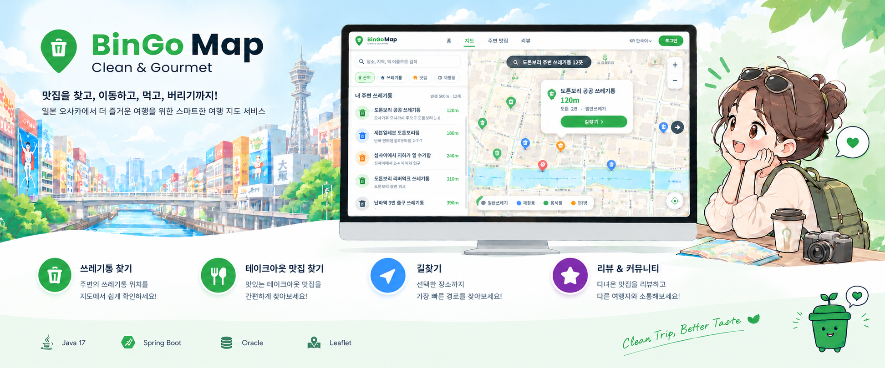
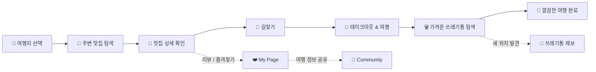
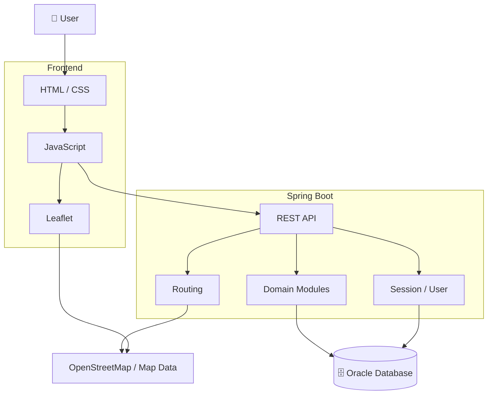

<!-- BinGo Map README -->

<div align="center">

# 🗑️ BinGo Map

### **Clean & Gourmet**

**먹고, 걷고, 깔끔하게 여행하세요.**

일본 여행 중 필요한 **쓰레기통 위치와 주변 테이크아웃 맛집을 하나의 지도 경험으로 연결하는 여행 서비스**입니다.

<br>



<br><br>

[](https://www.oracle.com/java/)
[](https://spring.io/projects/spring-boot)
[](https://gradle.org/)
[](https://www.oracle.com/database/)
[](https://leafletjs.com/)
[](https://www.openstreetmap.org/)

</div>

---

## 🌿 About BinGo Map

일본 여행에서는 길거리 음식과 테이크아웃 문화를 즐길 기회가 많지만, **음식을 먹은 뒤 가까운 쓰레기통을 찾는 일은 생각보다 쉽지 않습니다.**

BinGo Map은 이 문제를 해결하기 위해,

> **맛집을 찾고 → 이동하고 → 음식을 즐기고 → 가까운 쓰레기통을 찾는 과정**

을 하나의 흐름으로 연결합니다.

여행자가 자주 방문하는 **도톤보리 · 오사카성 · 유니버셜 스튜디오**를 기준점으로 주변 정보를 탐색하고, 실제 사용자 리뷰와 제보를 통해 여행 정보를 함께 쌓아갈 수 있도록 설계했습니다.

---

## ✨ Core Features

<div align="center">

| 🗑️ **Smart Bin Map** | 🍴 **Take-out Restaurants** |
|:---:|:---:|
| 지도에서 쓰레기통 위치 확인 | 주변 테이크아웃 맛집 탐색 |
| 카테고리별 필터링 | 평점·리뷰 기반 정보 확인 |
| 회원 제보 위치 확인 | 식당 상세 정보 제공 |

| 🧭 **Route Guidance** | 💬 **Community** |
|:---:|:---:|
| 출발지 → 맛집 경로 안내 | 리뷰 및 커뮤니티 |
| 맛집 → 쓰레기통 경로 안내 | 쓰레기통 위치 제보 |
| 도보 · 자전거 · 자동차 | 사용자 정보 공유 |

</div>

---

## 🗺️ Service Flow



---

## 🖥️ Product Preview

### 🗺️ 지도에서 한눈에

쓰레기통 위치를 지도에 표시하고, 현재 위치 또는 주요 관광지를 기준으로 주변 시설을 탐색합니다.

<div align="center">

</div>

### 🍴 여행지 주변 맛집

테이크아웃에 적합한 주변 맛집을 확인하고, 평점·리뷰·메뉴·영업 정보 등을 살펴볼 수 있습니다.

<div align="center">

</div>

### 🧭 맛집에서 쓰레기통까지

맛집을 방문한 뒤 가까운 쓰레기통까지 이어지는 이동 흐름을 지도 안에서 확인할 수 있습니다.

<div align="center">

</div>

### 💬 함께 만드는 여행 정보

리뷰와 커뮤니티, 쓰레기통 제보를 통해 다음 여행자에게 필요한 정보를 함께 쌓습니다.

<div align="center">

</div>

---

## 🏗️ System Architecture



---

## 🛠️ Tech Stack

| Category | Technology | Usage |
|---|---|---|
| **Language** | Java 17 | Backend |
| **Framework** | Spring Boot 4.1.1 | Web / REST API |
| **Persistence** | Spring Data JPA | Database access |
| **Database** | Oracle Database | User / Restaurant / Review / Community data |
| **Frontend** | HTML · CSS · JavaScript | UI / Interaction |
| **Map** | Leaflet | Interactive map |
| **Map Data** | OpenStreetMap / Overpass | Location & map-related data |
| **Build** | Gradle | Dependency / build management |
| **Security** | Spring Security Crypto | Password / security-related processing |

---

## 📦 Main Modules

```text
src/main/java/com/bingomap/bingo_map
├─ common
├─ community
├─ favorite
├─ map
├─ notice
├─ notification
├─ report
├─ restaurant
├─ restaurantmap
├─ review
├─ routing
└─ user
```

프론트엔드는 기능별 화면과 모듈을 분리해 관리합니다.

```text
src/main/resources/static
├─ admin
├─ auth
├─ community
├─ favorites
├─ images
├─ login
├─ map
├─ mypage
├─ notices
├─ password-reset
├─ report
├─ restaurants
├─ reviews
└─ signup
```

---

## 🔌 주요 API

### Restaurant

- `GET /api/restaurants`
- `GET /api/restaurants/{id}`
- `GET /api/restaurants/{id}/nearby`
- `GET /api/restaurants/popular`

### Map

- `GET /api/bins?city=osaka`
- `GET /api/map/restaurants`
- `GET /api/reports/approved`

### User / Session

`GET /api/session`

### Favorite

- `GET /api/favorites/status`
- `POST /api/favorites`
- `DELETE /api/favorites/{id}`

---

## 🗄️ Database

프로젝트 데이터는 Oracle Database를 기준으로 관리하며, 주요 도메인은 다음과 같이 구성되어 있습니다.

- 사용자 / 세션
- 맛집 / 메뉴
- 리뷰 / 리뷰 추천
- 즐겨찾기
- 커뮤니티 / 댓글
- 쓰레기통 / 회원 제보
- 알림 / 신고 / 관리자 기능

ERD와 팀 공통 SQL은 [`DB/`](./DB) 디렉터리와 [`document/`](./document) 디렉터리에서 확인할 수 있습니다.

---

## 🚀 Getting Started

### Requirements

- Java 17
- Oracle Database
- Gradle

### Run

```bash
./gradlew bootRun
```

Windows:

```bash
gradlew.bat bootRun
```

DB 접속 정보와 실행 환경은 프로젝트 설정에 맞게 구성해야 합니다.

---

## 📚 Documentation

프로젝트 설계와 개발 관련 자료는 다음 위치에 정리되어 있습니다.

- [`document/BinGo Map 프로젝트 사양·설계 및 개발 프로세스.txt`](./document/BinGo%20Map%20프로젝트%20사양·설계%20및%20개발%20프로세스.txt)

---

## 👥 Team

BinGo Map은 **5명이 함께 개발한 Java · Spring Boot 팀 프로젝트**입니다. 기능별로 구현한 뒤 GitHub 브랜치와 Pull Request를 통해 통합했습니다. 아래는 팀원별 주요 담당과 기여입니다.

- **[곽동곤](https://github.com/kdk4905) · 프로젝트 구조·통합** — Spring Boot 초기 구조 · Controller 골격 · 도메인 중심 패키지 개편 · Oracle 스키마 기준 DB·ERD 정리 · 즐겨찾기 · 리뷰 탭 · 메인 인기 맛집 · 기능 통합 · 문서화
- **[박주호](https://github.com/dnflwngh9087-prog) · 지도·경로 안내** — Oracle 쓰레기통 데이터·식당 지도 연동 · 도보·자전거·자동차 경로 안내 · 쓰레기통 위치 제보·즐겨찾기 지도 연동
- **[장준환](https://github.com/sgnq008-tech) · 주변 맛집** — 지역별 맛집 목록 · 검색·필터 · 상세 정보·메뉴·사진 · 주변 맛집 추천 · 지도·길찾기 연결 · 즐겨찾기 · 공개 상태 관리
- **[유해성](https://github.com/Hyesung1122) · 리뷰·커뮤니티** — 리뷰 CRUD · 사진 첨부 · 도움 기능 · 게시글·댓글·좋아요·검색 · 로그인 사용자 권한 처리
- **[안태건](https://github.com/dksxorjs1359) · 회원·서비스 운영** — 회원가입·로그인 · 마이페이지 · 관리자 기능 · 쓰레기통 제보 접수·검수 · 공지사항 관리 · 알림

---

## 🧹 Project Message

<div align="center">

### **Clean Trip, Better Taste.**

**여행은 즐겁게, 길은 편하게, 마무리는 깔끔하게.**

<br>

🗺️ &nbsp; 🍴 &nbsp; 🧭 &nbsp; 🗑️ &nbsp; 💬

<br>

`BinGo Map · Clean & Gourmet`

</div>
